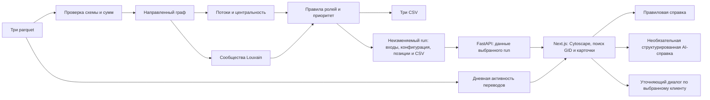

# Схема решения

Вход: `nodes.parquet`, `edges.parquet`, `transactions.parquet`. Граф остаётся направленным для всех потоковых признаков; неориентированная проекция используется только для сообществ. Дневная активность дополняет обзор анализа, но не меняет обязательные выгрузки. Один и тот же pipeline вызывают CLI и приложение. Модель получает лишь факты выбранного клиента и его соседей и не меняет расчёт.

`starter.py` запускает `analysis.py` напрямую для обязательных выгрузок. `run_store.py` вызывает то же ядро, сохраняет входы/конфигурацию/результаты и публикует только завершённый снимок. `api.py` отдаёт его через FastAPI. `web/components/` содержит общий инспектор, граф Cytoscape и страницы Next.js; `web/app/globals.css` задаёт светлую тему. `serve.py` запускает API и UI одной командой. GID в JSON строковые, суммы передаются decimal-строками; CSV сохраняет исходный контракт. Фильтры не меняют алгоритмический результат.

AI (`ai_chat.py`, `ai_safety.py`) вызывается только по явному запросу через backend и не меняет роли/CSV. `research.py` выполняет структурный эксперимент на копии графа. Предыдущий Streamlit (`app.py`, `workspace.py`, `ui.py`) сохранён как резервный интерфейс, но не является основной демонстрационной версией.
