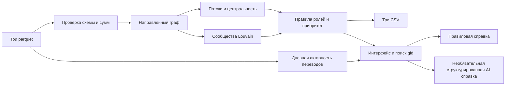

# Схема решения

Вход: `nodes.parquet`, `edges.parquet`, `transactions.parquet`. Граф остаётся направленным для всех потоковых признаков; неориентированная проекция используется только для сообществ. Дневная активность дополняет карточку, но не меняет обязательные выгрузки. Один и тот же pipeline вызывают CLI и приложение. Модель получает лишь факты выбранного клиента и не меняет расчёт.
