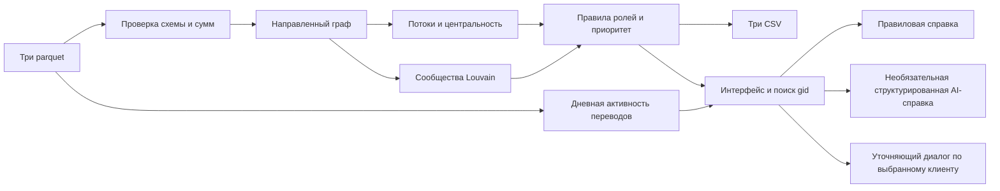

# Схема решения

Вход: `nodes.parquet`, `edges.parquet`, `transactions.parquet`. Граф остаётся направленным для всех потоковых признаков; неориентированная проекция используется только для сообществ. Дневная активность дополняет карточку, но не меняет обязательные выгрузки. Один и тот же pipeline вызывают CLI и приложение. Модель получает лишь факты выбранного клиента и не меняет расчёт.

`app.py` отвечает за входные файлы и запуск расчёта. `workspace.py` содержит четыре рабочих раздела и карточку клиента; `ui.py` объединяет фильтрацию, форматирование и переходы из таблиц. `assets/workspace.css` задаёт оформление и мобильные ограничения, `assets/network.html` использует встроенные ресурсы PyVis для графа. GID передаются в таблицы и JavaScript как строки, чтобы не терять точность длинных идентификаторов. Фильтры интерфейса не меняют аналитический результат или обязательные CSV.

Паттерны интерфейса: обзор перед деталями, постепенное раскрытие второстепенных оснований, отдельное представление источников и вычисленных результатов. Использованы [вкладки с управляемым состоянием Streamlit](https://docs.streamlit.io/develop/api-reference/layout/st.tabs) и [выбор строк таблиц](https://docs.streamlit.io/develop/api-reference/data/st.dataframe). Дизайн опирается на задачи поиска, сравнения и изучения записей из [рекомендаций NN/G по таблицам](https://www.nngroup.com/articles/data-tables/).
